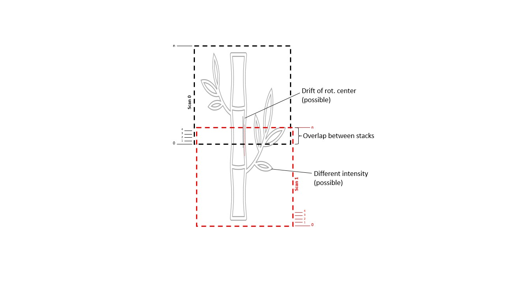

# stitch_scan
Process stitch scan reconstructions.



This script is used to rename and apply a 2D rigid transformation (affine or translate) to a specific set of slices
from a stitch scan reconstruction. Stitch scans are subsequent scans of a sample that is displaced vertically between scans.
The scan overlap and (optional) rigid transformation aligning two subsequent scans must be claculated before running this script.

The script writes renamed copies of the selected range of slices to a given output folder.
A rigid 2D transformation (identical for all slices) can be applied.
A gain factor can be multiplied to the stack slices.

### Usage
**stitch_scan** can be run from the command line as a script. To view the help type
```commandline
python stitch_scan.py -h
```

### Examples:
* Process selected slices of a stitch scan applying a rigid image translation of 4 voxels along vertical axis:
```commandline
python stitch_scan.py "/path_input_stack/slice_0000.tif" "/path_output_stack/slice_0000.tif" -si 107 112 -so 30 --translate 0 -4
```
    
* Copy and rename slices set applying a 20% Grey Value Gain:
```commandline
python stitch_scan.py "/path_input_stack/slice_0000.tif" "/path_output_stack/slice_0000.tif" -si 107 112 -so 30 -g 1.055 --verbose
```
